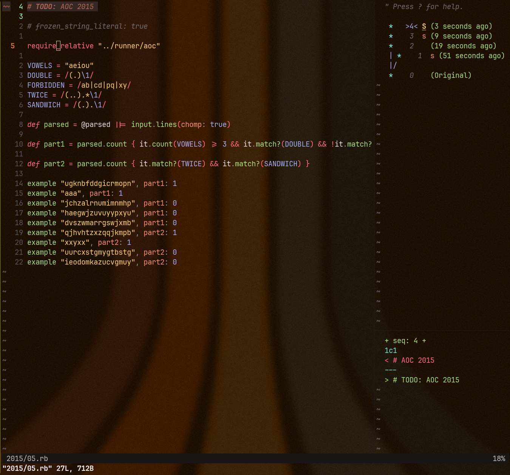
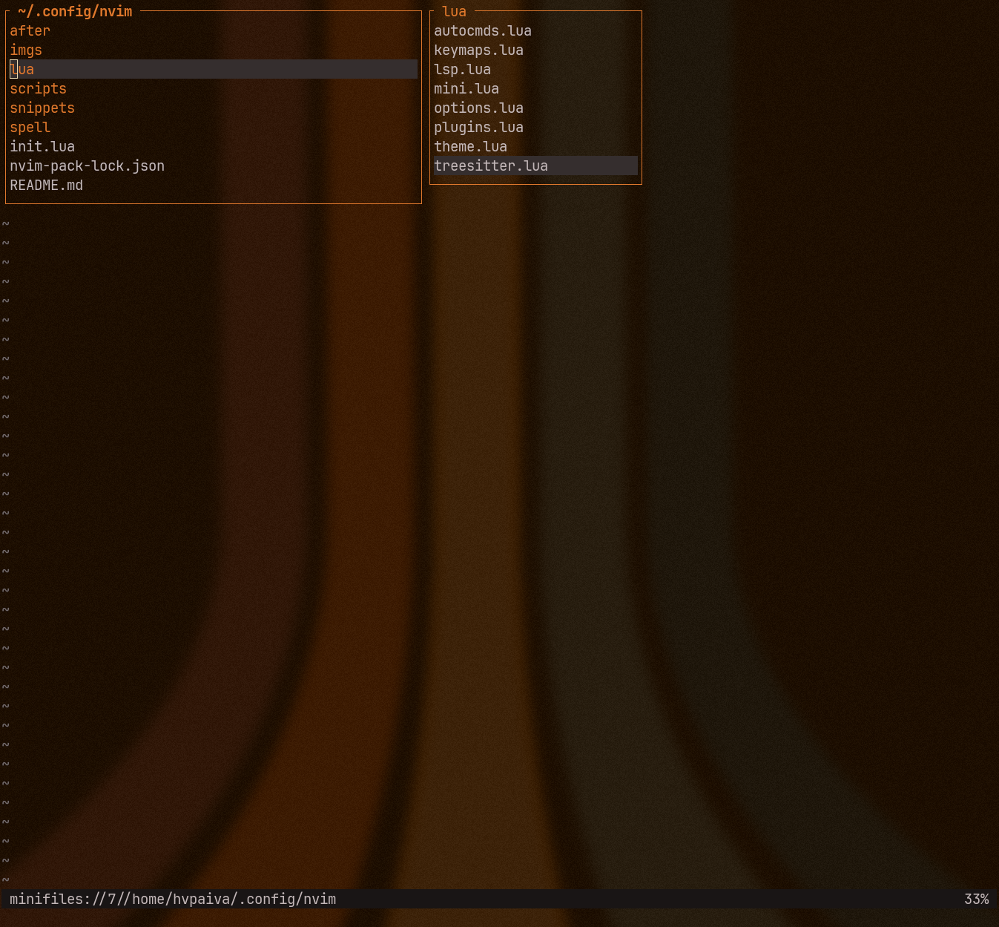
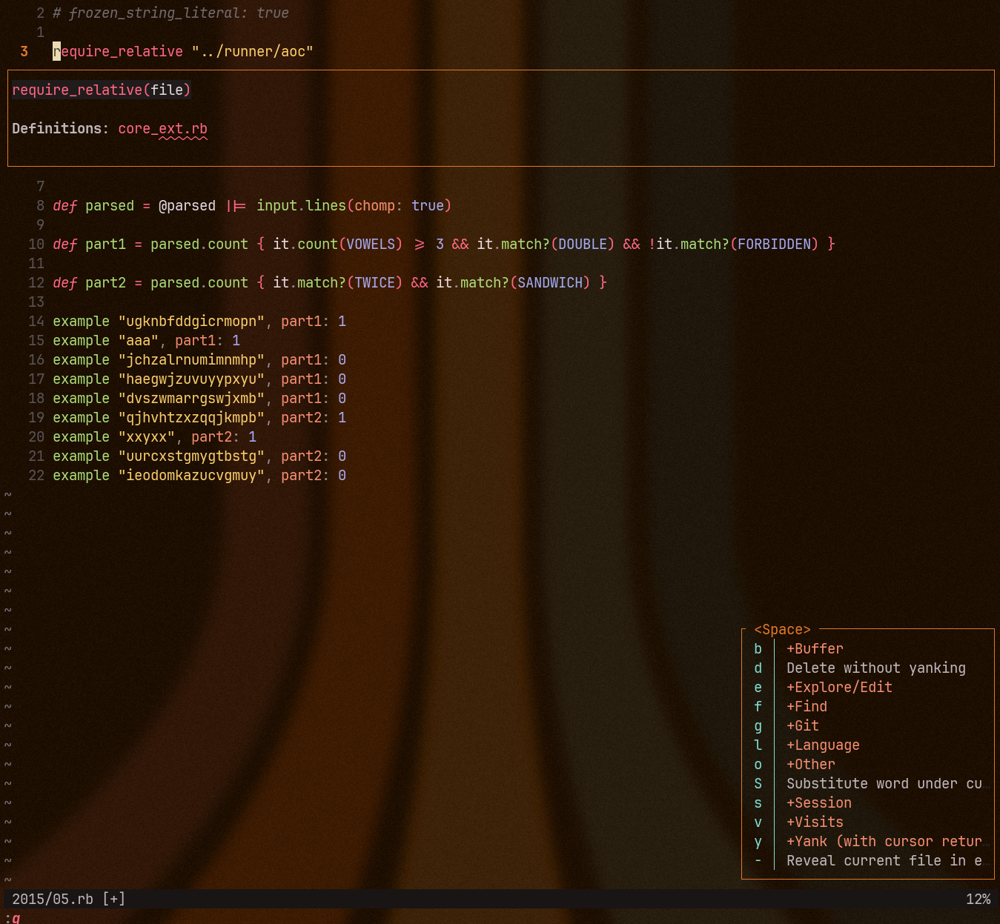
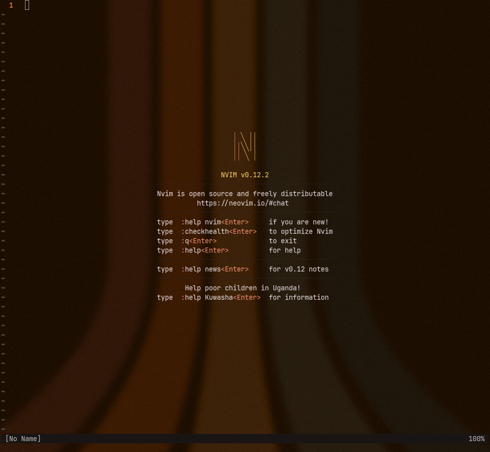

# nvim

My personal Neovim config.

The goal is to be complete in behavior but quiet in interface: no extra chrome, no noisy widgets, nothing that distracts from editing.

This is a keyboard-first setup built around native Neovim features, `mini.nvim`, native LSP, Tree-sitter, Fugitive, transparent Monokai Pro, persistent undo, and `mbbill/undotree`.

It is not a Neovim distribution. It is my daily config, published as-is.

## Screenshots

The UI is transparent. Background colors in these screenshots come from the terminal and wallpaper, not from Neovim itself.









## Requirements

- Neovim 0.12+
- `git`
- `ripgrep`
- `diff`
- A C toolchain for Tree-sitter parsers
- Optional language tooling for the LSPs you use: `go`, `rustup`, `mise`, `prettier`, `standardrb`, `rubocop`

## Install

Back up your current config first:

```bash
mv ~/.config/nvim ~/.config/nvim.bak
git clone https://github.com/hvpaiva/nvim ~/.config/nvim
nvim
```

Plugins are installed by Neovim through `vim.pack` on startup.

To install or refresh the external language tooling I use:

```bash
~/.config/nvim/scripts/nvim-lsp-install
```

## Structure

```text
init.lua             load order
lua/options.lua      editor defaults
lua/keymaps.lua      mappings
lua/plugins.lua      plugin list and non-mini setup
lua/mini.lua         mini.nvim modules
lua/theme.lua        colorscheme and highlights
lua/treesitter.lua   Tree-sitter setup
lua/lsp.lua          native LSP setup
scripts/             helper scripts
snippets/            personal snippets
spell/               spell dictionaries
```

Most details are documented as comments next to the relevant config.
