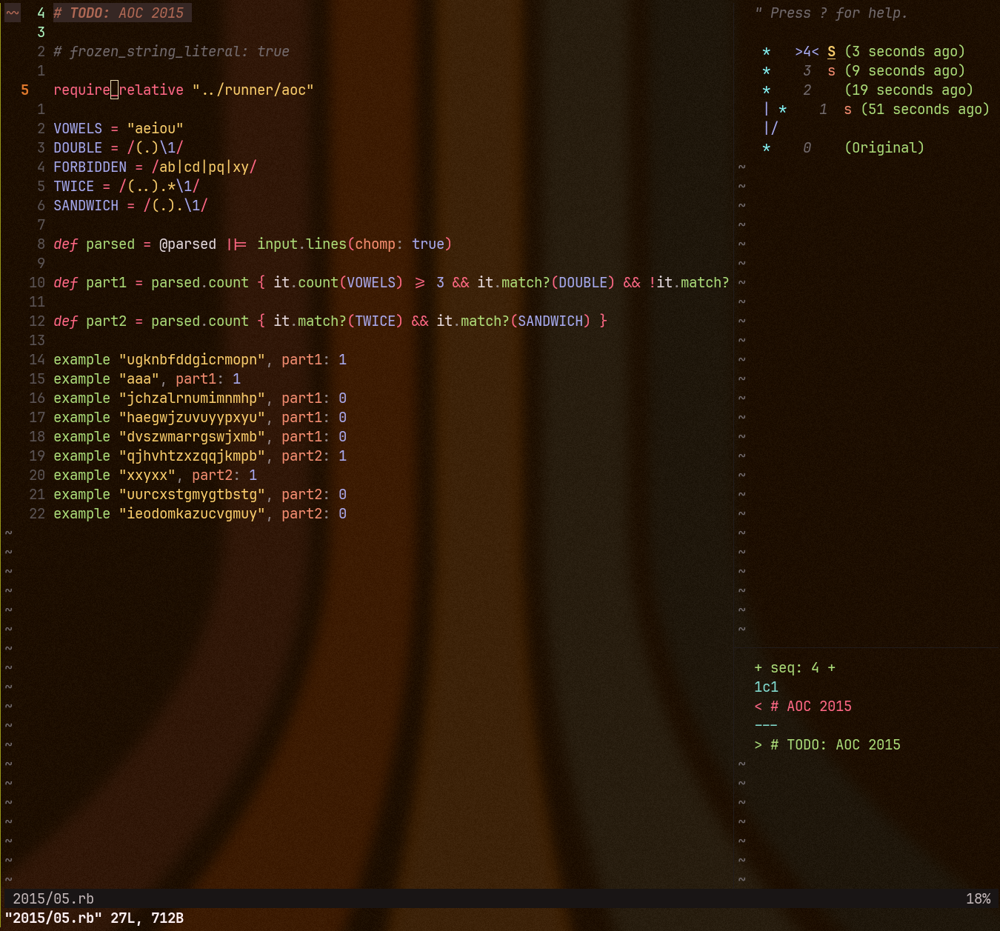
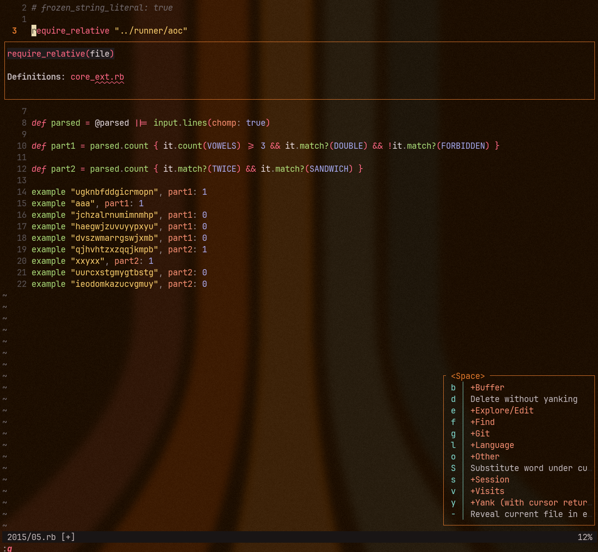
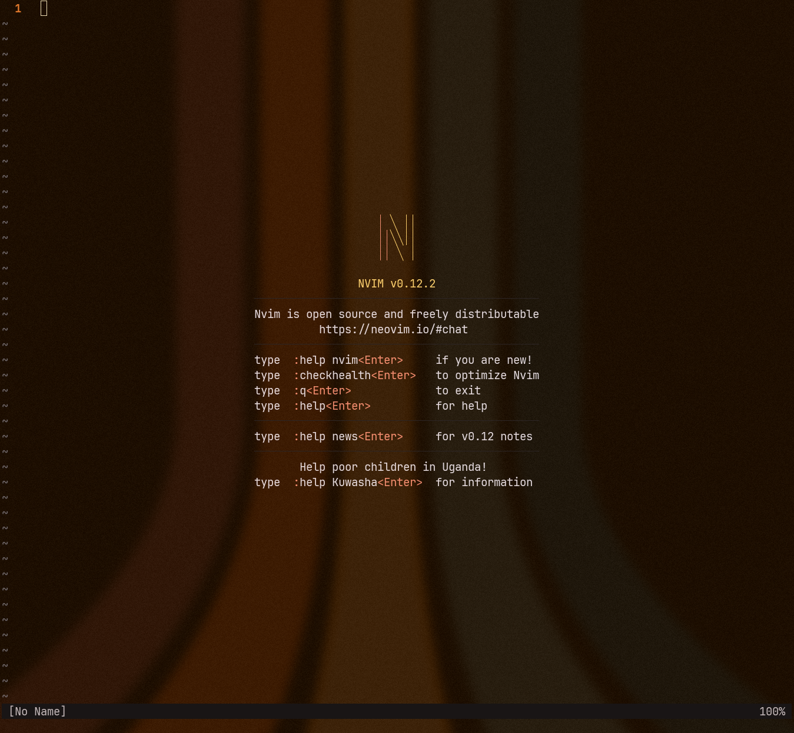

# nvim

My personal Neovim config.

The goal is to be complete in behavior but quiet in interface: no extra chrome, no noisy widgets, nothing that distracts from editing.

This is a keyboard-first setup built around native Neovim features, `mini.nvim`, native LSP, Tree-sitter, Fugitive, transparent Monokai Pro, persistent undo, and `mbbill/undotree`.

It is not a Neovim distribution. It is my daily config, published as-is.

## Screenshots

The UI is transparent. Background colors in these screenshots come from the terminal and wallpaper, not from Neovim itself.







## Requirements

- Neovim 0.12+
- `git`
- `ripgrep`
- `diff`
- A C toolchain for Tree-sitter parsers
- Toolchains used by the install script: `go` (gopls, goimports, shfmt, docker-language-server), `rustup` (rust-analyzer), `mise` (Ruby, standardrb, rubocop, ShellCheck, ruff, Terraform, terraform-ls, TFLint, taplo, golangci-lint), `npm` (prettier, basedpyright and the YAML, JSON, ESLint, shell, GitHub Actions and TypeScript servers)
- For Bash debugging, `bashdb` built for the running Bash (my [dotfiles](https://github.com/hvpaiva/dotfiles) build it into `~/.local`)

## Install

Back up your current config first:

```bash
mv ~/.config/nvim ~/.config/nvim.bak
git clone https://github.com/hvpaiva/nvim ~/.config/nvim
nvim
```

Plugins are installed by Neovim through `vim.pack` on startup, at the revisions in `nvim-pack-lock.json`. Plugins the config no longer adds (one removed here, an Omarchy theme no longer in use) are deleted on startup, so the lockfile follows the config on every machine.

To install or refresh the external language tooling I use:

```bash
~/.config/nvim/scripts/nvim-lsp-install
```

This installs language servers (`rust-analyzer`, `gopls`, `lua-language-server`, `marksman`, `helm_ls`, `yaml-language-server`, `vscode-json-language-server`, `vscode-eslint-language-server`, `bash-language-server`, `gh-actions-language-server`, `docker-language-server`, `typescript-language-server`, `basedpyright`, `ruff`, `terraform-ls`, `tflint`, `taplo`), the formatters (`stylua`, `shfmt`, `prettier`, `goimports`, `ruff`, `terraform fmt`, `taplo`, and the Ruby `standardrb` and `rubocop` via the `mise` gem backend) and the linters (`shellcheck`, `golangci-lint`). It also installs `ruby-lsp` and Solargraph into every Ruby mise has (see below). Conform picks up a project-local `node_modules/.bin/prettier` when present.

Code lenses and on-type formatting come only from the servers whose lenses `gl` can act on and whose as-you-type edits are the point: ruby-lsp (tests, `end` insertion), rust-analyzer (run, debug, references), terraform-ls (references) and gopls (`go.mod` and `go:generate` commands). Elsewhere they would only add "N references" noise or reformat lines against the project formatter.

Edits a server sends are applied with any insertion placed before a replacement that starts at the same spot, as the LSP specification orders them; ruby-lsp's Extract Variable sends them the other way round, which Neovim would apply over the shifted text.

`gq{motion}` formats code through Conform, and wraps text in prose (Markdown, commit messages, plain text), in comment-only ranges and wherever nothing formats; `gQ` formats the whole buffer; `gw` always wraps.

The script also installs GHC and HLS through the `mise-ghcup` backend, plus Cabal, Stack, Ormolu, HLint, and `cabal-gild` through mise. It registers the backend, enables mise's experimental backend support, and selects `latest` for these Haskell tools.

HLS handles `.hs`, `.lhs`, and `.cabal` files. Tree-sitter highlights Haskell, and the existing `gq` and `gQ` mappings format `.hs` files with Ormolu. Use `gQ` to format Cabal files through HLS and `cabal-gild`.

HLint runs through `nvim-lint` when entering or saving `.hs` and `.lhs` buffers. Suggestions appear as diagnostics and respect the project's `.hlint.yaml`.

After installing parsers and language servers, sanity-check with:

```vim
:checkhealth nvim-treesitter
:checkhealth vim.lsp
```

## Ruby and shell

`ruby-lsp` runs under the project's Ruby: Neovim starts it through `mise x` from the project root, so `.ruby-version` or `mise.toml` decide, not the Ruby Neovim was started with (Bundler refuses a Ruby the Gemfile does not pin). Its C extensions are built for one Ruby ABI, so it lives inside each Ruby rather than being a mise tool: mise installs it with every new Ruby from `~/.config/mise/default-gems`, and `scripts/nvim-ruby-lsp` installs it into the active Ruby on first use when missing. Its workspace is the project (Gemfile or repository), or the directory of a loose script; a script right in `$HOME` gets an empty workspace instead of indexing the whole home. The launcher loads `ruby/ruby_lsp_fresh_parse.rb` into it: ruby-lsp parses a request's document as the request arrives, possibly before applying the change sent just ahead of it, and the patch parses again right before the request runs, so completion after `.`, diagnostics and on-type edits see the current text.

Solargraph runs next to it, started the same way (`scripts/nvim-solargraph`, same workspace), for what ruby-lsp does not know: the types of locals and method returns (`lines = File.readlines(…)` then `lines.` completes Array's methods) and methods defined outside classes, as scripts have them. ruby-lsp in turn parses past syntax errors, follows `require` and renames a constant's file with it. Each request gets one answer, from ruby-lsp, which also asks Solargraph: `K`, `<C-]>` and signature help take Solargraph's answer when it has one, else ruby-lsp's (a file that does not parse yet, a gem Solargraph has not documented); `grn` renames constants through ruby-lsp and locals and methods through Solargraph; `grr` and workspace symbols list both servers' results once each. Completion lists both, Solargraph adding only names ruby-lsp lacks, and taking over when ruby-lsp only guessed the receiver's type ("Guessed receiver" in its documentation). Completion asked for by hand right after `.` or `::` reaches ruby-lsp as if the character had just been typed: asked plainly, ruby-lsp reads the next line as the method name (`"".` above `end` is `"".end`); `grt` (type definition) is Solargraph's alone. Diagnostics, formatting, folding and the rest stay with ruby-lsp, nvim-lint and Conform. Solargraph knows a gem only once it has documented it: in a bundle the launcher documents the bundle's gems in the background, at low priority, on first open (a large bundle takes minutes); until then ruby-lsp answers for them. Block parameters stay untyped for both servers.

Each Ruby file follows one style, Standard or RuboCop: a `.standard.yml` or `.rubocop.yml` decides, then the bundle's direct dependencies, then Standard. Formatting (`gQ`, `gq`) always goes through Conform with that tool, preferring an executable project binstub, then `bundle exec` when the lockfile has the gem, then the tool on `PATH`, all under the project's Ruby (`mise x`). It runs with `--fix-layout`: formatting only touches whitespace and line breaks, and style corrections (`warn` for `$stderr.puts`, a redundant `return`) stay diagnostics. Linting follows the same choice: ruby-lsp lints when the bundle carries the tool (its RuboCop integration, or the Standard add-on), and nvim-lint runs it otherwise (scripts outside a bundle, bundles without a linter) on open, on save, and once an edit settles (leaving Insert mode, or a pause after a Normal-mode change). Both paths report a cop with ruby-lsp's severities (conventions are INFO). Files nvim-lint lints still get ruby-lsp's quick fixes on `gra`, from an in-process server (`ruby_fixes`): per offense linted from the current text, autocorrect its cop on its own lines, or disable it for the line; and autocorrect all offenses. RuboCop daemons started by `--server` are stopped when Neovim exits.

ruby-lsp's test code lenses mark Minitest and test-unit tests under `test/` or `spec/`, with or without a bundle: `gl` on a test runs it from the workspace root in the same terminal as `<Space>t`, or debugs it. `<Space>rt` debugs the test around the cursor. RSpec has lenses only with the `ruby-lsp-rspec` add-on in the bundle; `<Space>t` runs it either way. Inlay hints (implicit `rescue`, hash shorthand values) show while `<Space>oh` has them on. `<C-]>` jumps to the definition at the cursor (vim-ruby's by-name tag maps are removed).

ruby-lsp's on-type formatting adds `end` after an opening line, a heredoc's terminator and the closing block pipe (typing the pipe yourself does not double it), and reindents a body when its `end` is typed, also while the completion menu is waiting for items. Brackets and quotes are mini.pairs', comment leaders 'formatoptions'. `=` indents like the file's style (vim-ruby's settings for Standard or RuboCop). friendly-snippets' Ruby snippets load in Ruby buffers, its RSpec snippets in `_spec.rb` files only.

Vim's Ruby and shell indent scripts need the regex syntax to leave strings and heredocs alone, so those filetypes keep it loaded under tree-sitter; `=` never changes a string's value. For shell, `gQ` (shfmt) is still the better reindent.

Shell scripts get `bash-language-server` with ShellCheck diagnostics and quick fixes; its optional checks come from `~/.config/shellcheckrc`, shared with the CLI. Inside a project the server indexes the whole tree for cross-file definitions and offers functions from every script. `shfmt` follows a project's `.editorconfig`, and Google's style otherwise (`-ci -bn`, the buffer's indent). friendly-snippets' shell snippets load in `sh`, `bash` and `zsh` buffers. The single-quoted programs of `jq`, `yq` and `awk` are highlighted as those languages. Saving a file with a shebang makes it executable.

Editing helpers for both:

| Keys | Action |
| --- | --- |
| `ao` / `io` | Block, conditional or loop (`do ... end`, `{ }`, Ruby `if`/`case`/`while` and modifiers, shell `if`/`for`/`while`) |
| `ac` / `ic` | Class (Ruby's `aM` / `iM` too) |
| `van` / `vin` | Grow / shrink the selection along the syntax tree (`aN`/`iN` are mini.ai's "next") |
| `gS` (Ruby) | Split/join blocks, modifier conditionals and literals (treesj; split hashes and arrays end without a comma) |
| `<Space>fp` (Ruby) | Pick one of the project's gems and open its directory |
| `<Space>ii` | Open the REPL: irb under the project's Ruby (with its bundle loaded), python3, or the shell |
| `<Space>il` / `<Space>ip` | Send the line / paragraph to the REPL |
| `<Space>i` (visual) | Send the selection to the REPL |

## Other languages

- **Python**: basedpyright for types (it resolves the project's `.venv`), ruff for lint, import sorting and formatting.
- **Terraform**: terraform-ls and TFLint, `terraform fmt`; `.tf` files are always Terraform, even when new.
- **TOML**: taplo, with schemas for `Cargo.toml`, `pyproject.toml` and others.
- **Go**: gopls with gofumpt, staticcheck and inlay hints; `gQ` runs goimports first. golangci-lint runs where the project has a `.golangci.*` config.
- **JavaScript/TypeScript**: ESLint where the project configures it; prettier formats web sources only when the project has a prettier config, the language server otherwise.
- **JSON and YAML**: SchemaStore's catalog validates known files (`package.json`, `tsconfig.json`, `Chart.yaml`, compose files...). GitHub workflows are left to the GitHub Actions server. Kubernetes manifests and Helm templates validate against the same Kubernetes version.
- **Docker**: compose files (`compose.yaml`, `docker-compose.*.yml`) and Bake files get docker-language-server alongside the YAML server.

The quickfix list is editable (quicker.nvim): change lines and `:w` to apply them to the files, `>` / `<` to show or hide context. Markdown spell checking builds its programming and personal word lists by itself (from vim-dirtytalk and `spell/custom.words`) and downloads missing languages without asking.

Diagnostics show in the sign column as a dot in their severity's color; marks `a`–`z` and `A`–`Z` show their letter there in the theme's cyan (guttermarks.nvim), except on a line that also has a diagnostic.

The terminal multiplexer takes `<C-Space>` and `<M-CR>`, so the keys that defaulted to them move: `<M-Space>` asks for completion in Insert mode (`<C-x><C-o>` too; `<C-n>` completes buffer words), and in a picker `<C-y>` narrows to the current matches and `<C-q>` chooses the marked items (a grep sends them to the quickfix list).

## Structure

```text
init.lua             load order
lua/options.lua      editor defaults
lua/keymaps.lua      mappings
lua/plugins.lua      plugin list and non-mini setup
lua/mini.lua         mini.nvim modules
lua/training.lua     motion training tools and coaching toggles
lua/workflow.lua     test runners and source/test navigation
lua/debugging.lua    DAP adapters and shared debugging mappings
lua/ruby_tools.lua   Ruby servers, style, lint, quick fixes, on-type edits, test lenses, gems
lua/rust_tools.lua   rust-analyzer run/debug lenses
lua/lenses.lua       shared code lens commands
lua/formatexpr.lua   gq: format code, wrap prose and comments
lua/repl.lua         REPL terminal fed from the buffer
lua/spell.lua        spell dictionaries, built on demand
lua/theme.lua        colorscheme and highlights
lua/treesitter.lua   Tree-sitter setup
lua/lsp.lua          native LSP setup
.stylua.toml         Lua formatting policy
ruby/                patch the ruby-lsp launcher loads
scripts/             helper scripts
snippets/            personal snippets
spell/               spell dictionaries
```

Most details are documented as comments next to the relevant config.

## Training

Training tools are installed but isolated behind `<Leader>p` so they can be kept
without making the normal editing path noisy. `hardtime.nvim` is the only active
coach by default; flip `training_enabled_by_default` in `lua/training.lua` when
that is no longer useful.

`<Leader>` is Space. Use `<Space>pp` to start training, `<Space>pS` to stop,
`<Space>pa` to analyse motions, `<Space>pb` for VimBeBetter, `<Space>pT` for
VimTeacher, `<Space>ph` for a movement hint, `<Space>pH` to toggle hints,
`<Space>pd` to toggle Hardtime, and `<Space>pr` for its report.

## Tests and navigation

The same mappings use vim-test's runner detection in every supported language.
Each test command runs from its project root through mise when available.
The test terminal is reused, and repeating a test preserves its original project.
Test frameworks remain project dependencies.

| Mapping | Action |
| --- | --- |
| `<Space>tt` | Run the nearest test |
| `<Space>tf` | Run the current test file, or the test alternate of a source file |
| `<Space>ts` | Run the test suite |
| `<Space>tl` | Repeat the last test |
| `<Space>tv` | Visit the last test |
| `<Space>ta` | Switch between source and test |
| `<Space>tA` | Open source/test alternate in a vertical split |

Default source/test conventions cover Ruby, Go, Rust, JavaScript, TypeScript,
Python, Haskell, Lua, and shell. A project's `.projections.json` can provide its
own layout. Rust unit tests inside the source file can be run directly.
Haskell selects Stack when `stack.yaml` exists, otherwise Cabal; test granularity
depends on the runner.

## Debugging

Install or refresh the adapters through mise:

```bash
~/.config/nvim/scripts/nvim-debug-install
```

This installs Delve, debugpy, the JavaScript debug adapter, CodeLLDB and the Bash
debug adapter. rdbg ships with every Ruby, and the project's own runs; bashdb comes
from the dotfiles (the adapter's bundled copy predates current Bash).
The configuration supports Ruby files, Minitest/RSpec and single tests, Go packages
and tests, Python, Node JavaScript/TypeScript, Bash scripts, and compiled
Rust/C/C++ executables.
Ruby uses Bundler when a Gemfile is present; bundled debugging requires the
`debug` gem in that bundle. Python prefers a project's `.venv`.
Rust/C/C++ prompt for a compiled executable with debug symbols.
Node projects that require a build step, a runtime loader, or browser debugging
can supply their own `.vscode/launch.json`, which nvim-dap loads automatically.

| Mapping | Action |
| --- | --- |
| `<Space>rr` | Start or continue |
| `<Space>rb` / `<Space>rB` | Toggle breakpoint / conditional breakpoint |
| `<Space>rn` / `<Space>ri` / `<Space>ro` | Step over / into / out |
| `<Space>re` / `<Space>rs` | Inspect value / scopes |
| `<Space>rc` | Toggle debug console |
| `<Space>rl` | Repeat the last session |
| `<Space>rt` | Debug the test around the cursor (Ruby) |
| `<Space>rq` | Stop debugging |

These mappings are global; adding a DAP adapter for another language reuses them.

## Verification

```bash
stylua --check .
shellcheck scripts/*
nvim --headless -u NONE -n -i NONE -l tests/workflow.lua
NVIM_DEBUG_TEST_LANGUAGE=ruby nvim --headless -u NONE -n -i NONE -l tests/debugging.lua
for t in languages editing; do
  nvim --headless -i NONE --cmd 'let g:minivisits_disable = v:true' \
    -c "lua local ok, err = xpcall(dofile, debug.traceback, 'tests/$t.lua') if not ok then io.stderr:write(err, '\\n') vim.cmd('cquit 1') end"
done
```

The workflow checks use temporary fixtures and capture commands without running
project tests. Debugging checks launch temporary programs and verify a breakpoint,
value inspection, and stepping. The debug selector also accepts `ruby_bundle`,
`go`, `rust`, `python`, `javascript`, `typescript`, and `bash`; each requires its
toolchain and adapter. The language and editing checks load the full config
against temporary fixtures (the loop above fails instead of hanging on an error).
Language checks cover Ruby and shell: style and lint ownership, test lenses,
the merge of ruby-lsp's and Solargraph's answers, ruby-lsp and bashls settings,
shfmt style, shell snippets, text objects, treesj, injections, the REPL, and
indentation that keeps string bodies. Editing checks
cover the rest: mappings, `gq`, folds, spell lists, filetypes, the language
servers' settings, formatters and the code lens commands.
